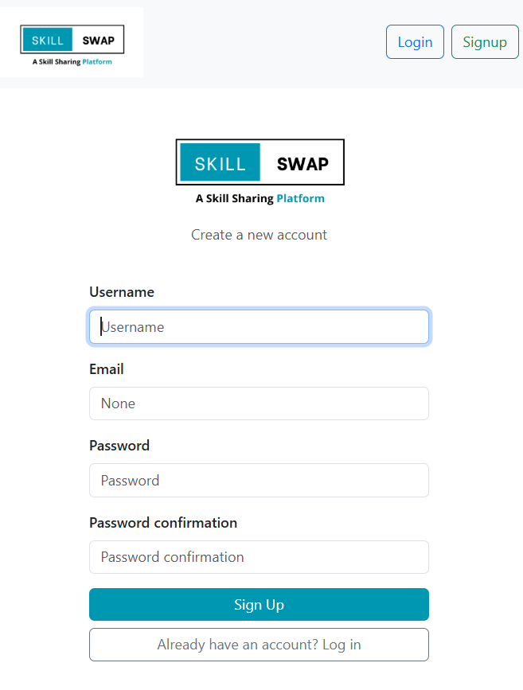
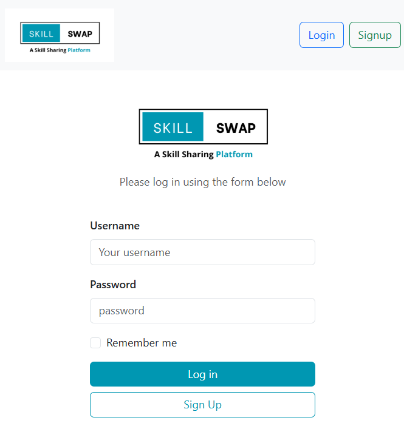
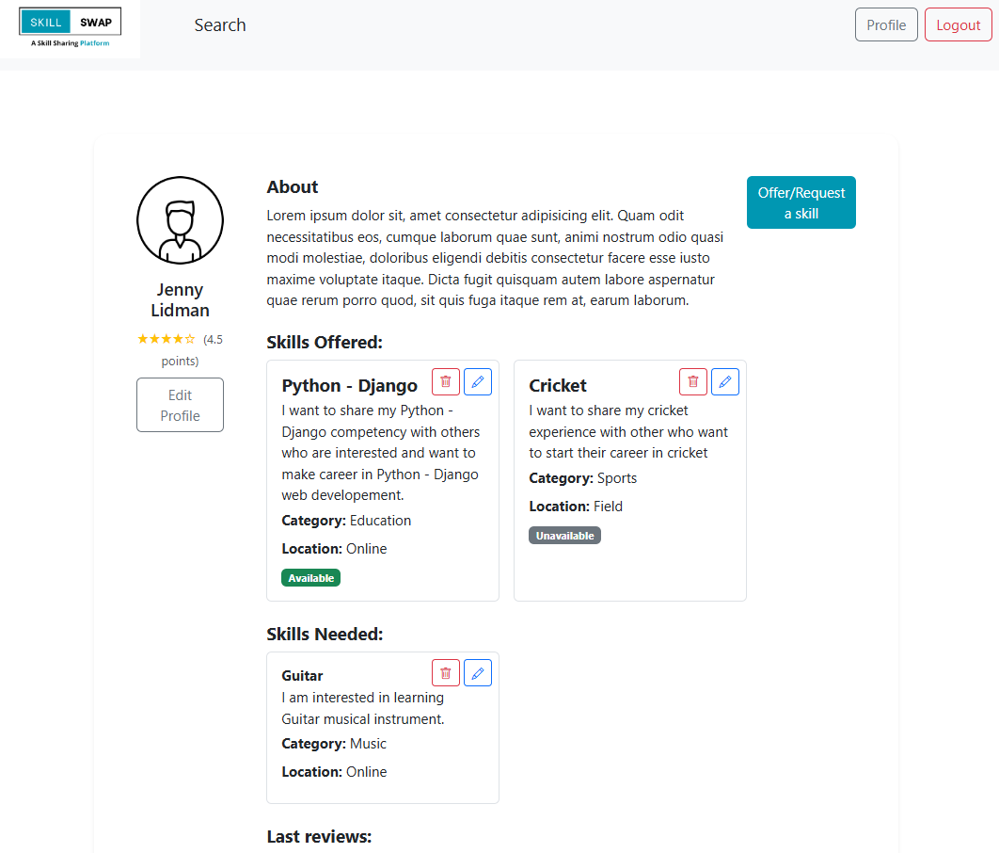
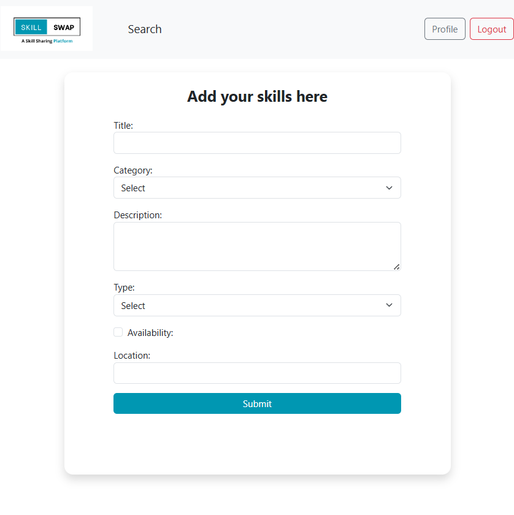
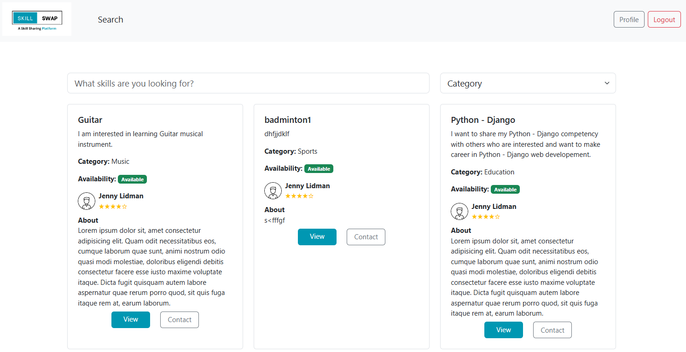

# Skill Swap

## Project title and description

**Skill Swap** is a web application that allows users to share and exchange skills with others. Users can add their skills, browse available skills, and connect with other members to learn or collaborate.

## Team members

* Anna Bilokon
* Punam Ahirrao
* Kalpana Siddappa
* Jim Jonatan Ojala
* Daniel Hans Ragnar Jäderberg

## Features Available

**1. User Authentication**
- User can signup, login, and logout
- Profile creation and editing

**2. Skill Listings**

- Users can post a skill they want to offer or request
- User also can Update and Delete the skills 

**3. Search/Browse**

- See all skills by Title 
- View detail page of each listing with Contact details.

**4. Contact/Request**

- Users can click “Contact” → basic messaging. 

**5. Reviews/Ratings**

- After a session, users can leave a 1–5 star rating and short review.0


## Tech stack (Django, Bootstrap, etc.)

* Backend: Django (Python) 
* Frontend: Bootstrap 5, HTML, CSS
* Database: SQLite
* Template engine: Django Templates

## How to install & run the project locally

1. Clone the repository:

   ```bash
   https://github.com/kalpana002/SkillShare.git
   ```
2. Navigate to the project directory:

   ```bash
   cd SkillShare
   ```
3. Create a conda environment on  and activate it:

   ```bash
   cmd > conda create --name skillswap
   cmd > conda activate skillswap
   ```
4. Install dependencies:

   ```bash
   pip install django
   ```
5. Apply migrations:

   ```bash
   python manage.py migrate
   ```
6. Run the development server:

   ```bash
   python manage.py runserver
   ```
7. Open your browser and go to `http://127.0.0.1:8000/`

## Screenshots (optional)


*User registration*


*User can login to app*


*User can view and update profile*


*Users can add Skills that they want to request / offer*


*User can search all skills and request for swap*


## Link to Trello board

[Skill Swap Trello Board](https://trello.com/b/dHLHXOgQ/my-trello-board)

---
